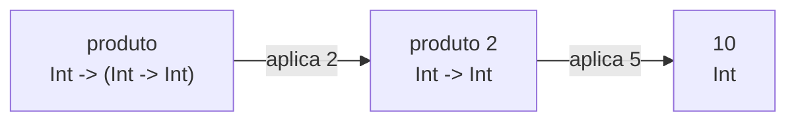

# Paradigmas de Programação — Aula 07: Funções parciais, tipos algébricos e tipos polimórficos — Funções parciais e currying

## Introdução

O termo **função parcial** carrega dois sentidos distintos, e confundi-los
impede a leitura correta de boa parte do código funcional. O primeiro sentido é
o de **aplicação parcial**: fornecer a uma função menos argumentos do que ela
aparenta receber, obtendo outra função. O segundo é o sentido matemático de
**função não-total**: uma função indefinida em parte do seu domínio.

Os dois aparecem no mesmo material e não têm relação entre si. Esta nota trata
primeiro do mecanismo que produz o primeiro sentido — a forma unária de toda
função em Haskell — e encerra separando-o do segundo.

## Objetivos de aprendizagem

Ao final desta nota, espera-se que o aluno seja capaz de:

1. Demonstrar que toda função em Haskell é unária, reescrevendo
   `Int -> Int -> Int` na sua forma associada à direita `Int -> (Int -> Int)`.
2. Derivar a aplicação parcial como consequência do tipo, e não como recurso
   sintático da linguagem.
3. Distinguir os dois sentidos de *função parcial* e classificar uma definição
   dada em um dos dois.

## Desenvolvimento teórico

### Toda função é unária

Em Haskell **não existe função de dois argumentos**. A aparência de uma vem da
combinação de duas convenções de associatividade que atuam em níveis diferentes.

A primeira governa o **tipo**. O construtor de tipo `->` associa à **direita**:

```
Int -> Int -> Int          é o mesmo que
Int -> (Int -> Int)
```

Lido assim, `produto` não é uma função que recebe dois inteiros. É uma função
que recebe **um** inteiro e devolve **uma função** de `Int` em `Int`.

A segunda governa a **aplicação**, que associa à **esquerda**:

```
produto 2 5                é o mesmo que
(produto 2) 5
```

A derivação completa, passo a passo, para `produto 2 5`:

| Passo | Expressão | Tipo do que está à esquerda |
|-------|-----------|------------------------------|
| 1 | `produto` | `Int -> (Int -> Int)` |
| 2 | `produto 2` | `Int -> Int` |
| 3 | `(produto 2) 5` | `Int` |

Cada aplicação consome exatamente uma seta. Essa organização — toda função
unária, com funções devolvendo funções — chama-se **currying**, em referência a
Haskell Curry, de quem a linguagem também toma o nome.



### Aplicação parcial

Da forma unária decorre imediatamente a **aplicação parcial**: interromper a
cadeia de aplicações em qualquer ponto produz um valor legítimo, que é uma
função.

```haskell
produto :: Int -> Int -> Int
produto x y = x * y

duplicar :: Int -> Int
duplicar = produto 2

triplicar :: Int -> Int
triplicar = produto 3
```

`produto 2` é uma função **completa** de tipo `Int -> Int`, e não uma chamada
inacabada à espera do segundo argumento. Nenhum mecanismo novo entra em cena: é
a aplicação comum, interrompida onde o tipo permite. A linguagem não oferece
"aplicação parcial" como recurso — ela oferece funções unárias, e a aplicação
parcial é uma consequência.

O uso mais frequente é a produção de funções sob medida para passar a funções de
alta ordem:

```haskell
map (produto 10) [1, 2, 3]    -- [10,20,30]
```

### Estilo point-free

Quando a definição consiste apenas em aplicar parcialmente outra função, o
argumento não precisa ser nomeado:

```haskell
logBase10 :: Double -> Double
logBase10 = logBase 10
```

A definição é uma **igualdade entre funções**, e não uma descrição do que fazer
com um argumento. O estilo chama-se ***point-free*** — sem pontos, no sentido de
sem os valores do domínio. Ele é preferível quando torna a definição mais curta
e mais próxima da intenção, e prejudicial quando obriga a reconstruir mentalmente
os argumentos omitidos.

### `curry` e `uncurry`

Uma função sobre pares e a sua versão curried carregam a mesma informação, e a
biblioteca padrão oferece a tradução nos dois sentidos:

```haskell
curry   :: ((a, b) -> c) -> a -> b -> c
uncurry :: (a -> b -> c) -> (a, b) -> c
```

```haskell
produtoEmPar :: (Int, Int) -> Int
produtoEmPar = uncurry produto

produtoDeVolta :: Int -> Int -> Int
produtoDeVolta = curry produtoEmPar
```

As duas formas são **isomorfas**: aplicar `curry` após `uncurry` recupera a
função original. A diferença é de conveniência — a forma curried admite
aplicação parcial, a forma sobre pares recebe seus dois valores de uma vez.

### O segundo sentido de "parcial": função total e função parcial

Uma função `f :: A -> B` é **total** quando, para **todo** valor de `A`, a
aplicação `f x` termina e produz um valor de `B`. São três exigências
independentes, e cada uma pode falhar sozinha:

1. a aplicação produz **algum** resultado;
2. em **tempo finito**;
3. do **tipo prometido**.

Uma função que falhe em qualquer das três, para pelo menos um valor do domínio,
é **parcial** no sentido matemático — sentido que não tem relação alguma com a
aplicação parcial das seções anteriores.

A definição é sobre o **domínio declarado**, e é daí que vem a assimetria com o
tipo. `cabeca :: [a] -> a` declara como domínio *todas* as listas de `a`; se
existe uma lista para a qual não há resposta, a função não cumpre o que o tipo
promete.

#### As quatro formas de deixar de ser total

Uma equação faltando é apenas a primeira delas, e é a única que o compilador
acusa:

| Forma | Exemplo | O que acontece |
|---|---|---|
| Equação faltando | `cabeca []` | `Non-exhaustive patterns in function cabeca` |
| Chamada a `error` ou `undefined` | `head []` | `Prelude.head: empty list` |
| Não-terminação | `laco x = laco x` | nada: o programa não termina |
| Operação parcial embutida | `div 1 0` | `divide by zero` |

As quatro mensagens acima, exceto a terceira, são as que o GHC 9.6 de fato
emite. A distinção entre as linhas é prática:

- **`-Wincomplete-patterns` só detecta a primeira.** As outras três são código
  de aparência normal, que passa por toda a checagem de tipos.
- A segunda é a mais comum na biblioteca padrão. `head`, `tail`, `fromJust` e
  `(!!)` são parciais por chamada explícita a `error`, não por descuido.
- **A terceira não produz erro algum.** Não há exceção a capturar, não há
  mensagem, não há saída: o programa fica preso. É a forma de não-totalidade que
  nenhuma ferramenta detecta em geral, pela indecidibilidade do problema da
  parada.

#### O habitante escondido de todo tipo

Uma sutileza técnica que costuma confundir quem encontra o termo pela primeira
vez. Em Haskell, todo tipo possui **um habitante a mais** do que a sua
declaração sugere: o valor indefinido, escrito ⊥ e lido *bottom*, que representa
"não há resultado". O tipo `Bool` tem três habitantes — `True`, `False` e ⊥.

Sob essa leitura, **toda** função em Haskell é tecnicamente total, porque
sempre devolve algo, ainda que esse algo seja ⊥. A distinção que interessa na
prática é outra, e é a que este material adota:

> Uma função é tratada como **parcial** quando existe pelo menos um valor do
> domínio declarado para o qual ela não produz um resultado **útil**.

#### Como reconhecer

Para decidir se uma definição é total, a verificação é mecânica:

1. compilar com `-Wincomplete-patterns` e conferir que não há aviso;
2. procurar no corpo por `error`, `undefined`, `head`, `tail`, `fromJust`,
   `(!!)` e chamadas semelhantes;
3. conferir que toda recursão tem caso-base alcançável;
4. procurar por operações parciais embutidas, como divisão e raiz.

Passando nos quatro, a função é total.

#### Três formas de tornar uma função total

A tabela compara as saídas, sobre o mesmo problema — obter o primeiro elemento
de uma lista:

| Estratégia | Assinatura | O que custa |
|---|---|---|
| **Restringir o domínio** | `NonEmpty a -> a` | quem chama precisa provar que a lista não é vazia, antes |
| **Alargar o contradomínio** | `[a] -> Maybe a` | quem chama precisa tratar o caso da ausência |
| **Escolher um valor padrão** | `[Int] -> Int` | **perde informação** |

A terceira é a mais barata de escrever e a pior das três:

```haskell
primeiroOuZero :: [Int] -> Int
primeiroOuZero []      = 0
primeiroOuZero (x:_)   = x
```

A definição é total — não há entrada que a faça divergir. Mas ela **confunde
dois casos distintos**: "não há primeiro elemento" e "o primeiro elemento é
zero" produzem a mesma saída, e quem chama não tem como separá-los. O defeito
saiu do tempo de execução e entrou na lógica do programa, o que é pior, porque
deixa de haver mensagem de erro.

A terceira estratégia, além disso, só existe porque o tipo do elemento é
conhecido. Para `[a] -> a` não há valor padrão possível: não se fabrica um `a`
sem saber o que `a` é — argumento desenvolvido na primeira nota. Daí decorre que
**não existe função total de tipo `[a] -> a`**, e que a segunda estratégia é a
única geral. Ela exige o tipo `Maybe`, construído na nota sobre tipos
polimórficos.

#### Os dois sentidos, lado a lado

| | Aplicação parcial | Função parcial (não-total) |
|---|---|---|
| **O que é** | uma função obtida fornecendo parte dos argumentos | uma função indefinida em parte do domínio |
| **Exemplo** | `produto 2` | `cabeca []` |
| **Produz** | um valor legítimo, do tipo `Int -> Int` | nenhum valor útil |
| **Aparece no tipo** | sim — o tipo residual é visível | **não** — o tipo não registra a lacuna |
| **É desejável** | sim, é uso idiomático | não, é defeito a eliminar |

Os dois usos do termo são consagrados e nenhum vai desaparecer. A leitura correta
depende do contexto: "aplicação parcial" refere-se sempre ao primeiro, e "função
parcial" sozinho, ao segundo.

## Exemplos

O arquivo `codigo/02-parciais-e-currying.hs` reúne os exemplos desta nota:

```sh
docker run --rm -v "$PWD":/w -w /w haskell:9.6-slim \
  runghc -Wincomplete-patterns 02-parciais-e-currying.hs
```

Duas saídas merecem atenção. A primeira é `logBase10 1000`, que imprime
`2.9999999999999996` e não `3.0` — resultado da aritmética de ponto flutuante
binária, sem relação com o assunto desta nota. A segunda é a última linha do
arquivo, comentada:

```haskell
-- print (cabeca ([] :: [Int]))
```

Descomentá-la produz um programa que compila e falha em execução. A mensagem de
erro é a prova de que o tipo não cobriu o caso.

## Fontes e leituras

- LIPOVAČA, Miran. **Learn You a Haskell for Great Good!: a beginner's guide.**
  San Francisco: No Starch Press, 2011. Capítulo 6 (*Higher Order Functions*),
  cuja seção inicial trata de funções curried e aplicação parcial. Versão online
  em https://learnyouahaskell.github.io/ (*fork* comunitário, licença Creative
  Commons BY-NC-SA 3.0; a autoria indicada acima provém da edição impressa e não
  consta do site).

- TATE, Bruce A. **Seven Languages in Seven Weeks: a pragmatic guide to learning
  programming languages.** Raleigh: Pragmatic Bookshelf, 2010. Capítulo 8
  (Haskell), dia 2.
