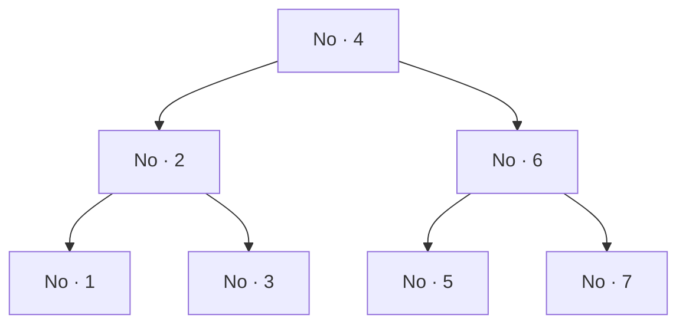

# Paradigmas de Programação — Aula 07: Funções parciais, tipos algébricos e tipos polimórficos — Tipos de dados algébricos

## Introdução

Um **tipo de dados algébrico** é um tipo construído a partir de outros tipos por
duas operações: **soma**, que oferece alternativas, e **produto**, que agrupa
campos. O adjetivo "algébrico" não é metáfora — as duas operações se comportam
como a soma e o produto da aritmética sobre a quantidade de valores que cada
tipo possui, e é dessa correspondência que o nome vem.

Esta nota trata da construção desses tipos, do que o casamento de padrão sobre
eles garante, e do que a imutabilidade implica para estruturas de dados
construídas dessa forma. Todos os tipos aqui são **monomórficos**: nenhum tem
parâmetro. A generalização é assunto da nota seguinte.

## Objetivos de aprendizagem

Ao final desta nota, espera-se que o aluno seja capaz de:

1. Definir um tipo algébrico como soma de produtos e calcular a cardinalidade do
   tipo a partir da dos construtores.
2. Implementar uma estrutura de dados recursiva como tipo algébrico monomórfico
   e um algoritmo sobre ela por casamento exaustivo, relacionando um caso do
   algoritmo a cada construtor do tipo.
3. Explicar por que "alterar" uma estrutura imutável produz uma estrutura nova
   que compartilha os ramos não tocados, e identificar, no código de uma função
   de atualização, quais partes são reconstruídas e quais são reaproveitadas.

## Desenvolvimento teórico

### Antes de começar: a cláusula `deriving`

Toda declaração desta nota termina com uma linha do tipo `deriving (Show, Eq)`,
e convém saber o que ela faz antes de encontrá-la pela primeira vez.

A cláusula instrui o compilador a **gerar automaticamente**, para o tipo
declarado, as operações que ela nomeia. Duas bastam por enquanto:

| Classe | O que passa a ser possível |
|---|---|
| `Show` | converter um valor em texto — é o que `print` exige |
| `Eq` | comparar dois valores com `==` e `/=` |

Um tipo recém-declarado não sabe fazer nenhuma das duas coisas. Sem a cláusula,
`print Espadas` não chega a compilar:

```
error: [GHC-39999]
    • No instance for ‘Show Naipe’ arising from a use of ‘print’
```

Nesta nota a cláusula é usada como **ferramenta**: os tipos precisam imprimir e
comparar para que os exemplos possam ser executados. *Por que* a linguagem
consegue gerar essas operações sozinha — e o que mais admite ser derivado — é
assunto da nota sobre tipos polimórficos, e a resposta depende justamente de o
tipo ser algébrico.

### Soma

A declaração `data` com construtores separados por `|` define um tipo cujos
valores são **exatamente** os construtores listados:

```haskell
data Naipe = Espadas | Copas | Ouros | Paus
  deriving (Show, Eq)
```

`Naipe` possui quatro valores e nenhum outro. A construção chama-se **soma**
porque a quantidade de valores do tipo é a soma das quantidades oferecidas por
cada alternativa.

A semelhança com o `enum` das linguagens da família C é superficial e enganosa.
Naquelas linguagens, os valores do `enum` são inteiros disfarçados: admitem
aritmética, comparação e conversão silenciosa para números fora do conjunto
declarado. Os construtores de `Naipe` não são inteiros, não admitem aritmética, e
só possuem ordem porque as instâncias correspondentes foram derivadas
explicitamente — mecanismo tratado na nota seguinte.

### Produto

Um construtor pode receber argumentos. O tipo resultante agrupa os campos:

```haskell
data Valor = As | Dois | Tres | Quatro | Cinco | Seis | Sete
           | Oito | Nove | Dez | Valete | Dama | Rei
  deriving (Show, Eq)

data Carta = Carta Naipe Valor
  deriving (Show, Eq)
```

Um valor de `Carta` é um par: um `Naipe` e um `Valor`. A quantidade de valores
distintos de `Carta` é o **produto** das quantidades dos campos — `4 × 13 = 52`.

A contagem não é afirmação sobre a notação; é verificável por enumeração:

```haskell
naipes :: [Naipe]
naipes = [Espadas, Copas, Ouros, Paus]

valores :: [Valor]
valores = [As, Dois, Tres, Quatro, Cinco, Seis, Sete,
           Oito, Nove, Dez, Valete, Dama, Rei]

baralho :: [Carta]
baralho = [Carta n v | n <- naipes, v <- valores]
```

`length baralho` devolve `52`.

O construtor de dado também pode ser aplicado diretamente, uma combinação de
cada vez. Uma mão de cinco cartas é uma lista de cinco aplicações de
`Carta :: Naipe -> Valor -> Carta`:

```haskell
maoBaralho :: [Carta]
maoBaralho =
  [ Carta Espadas As
  , Carta Copas   Dez
  , Carta Ouros   Dama
  , Carta Paus    Sete
  , Carta Copas   Rei
  ]
```

Que toda carta da mão pertença ao baralho é verificável —
``all (`elem` baralho) maoBaralho`` devolve `True` —, e a verificação só é possível porque `Carta` deriva `Eq`:
comparar dois valores de um tipo produto é comparar os campos um a um.

### Por que "algébrico"

Escrevendo `|T|` para a quantidade de valores distintos do tipo `T`, as duas
construções obedecem às regras da aritmética:

| Construção | Exemplo | Cardinalidade |
|---|---|---|
| Soma | `data Bool = False \| True` | `1 + 1 = 2` |
| Produto | `data Carta = Carta Naipe Valor` | `4 × 13 = 52` |
| Unidade | `data Unit = Unit` | `1` |
| Vazio | `data Void` | `0` |

As identidades da álgebra valem sobre os tipos. O produto por um tipo de
cardinalidade `1` não acrescenta informação — `(a, Unit)` carrega exatamente o
que `a` carrega. A soma com um tipo de cardinalidade `0` não acrescenta
alternativa alguma. E dois tipos com a mesma cardinalidade obtida por caminhos
diferentes são isomorfos: `(a, Bool)` e a soma `a + a` têm ambos `2 × |a|`
valores, e existe correspondência um a um entre eles.

É essa correspondência sistemática entre construções de tipo e operações
aritméticas que dá nome à família.

### Soma de produtos

As duas construções se combinam, e é a combinação que aparece na prática:

```haskell
data Forma = Circulo Float Float Float
           | Retangulo Float Float Float Float
  deriving (Show)
```

`Forma` é a soma de um produto de três `Float` com um produto de quatro `Float`
— na notação de cardinalidade, `|Float|^3 + |Float|^4`. A forma geral de um tipo
algébrico é exatamente esta: uma soma de produtos.

O casamento de padrão desmonta o valor identificando o construtor e ligando os
campos a nomes:

```haskell
area :: Forma -> Float
area (Circulo _ _ r)         = pi * r ^ (2 :: Int)
area (Retangulo x1 y1 x2 y2) = abs (x2 - x1) * abs (y2 - y1)
```

### Construtor de tipo e construtor de dado

Dois mundos distintos coexistem na mesma declaração, e a linguagem permite que o
mesmo identificador nomeie um habitante de cada um.

À **esquerda** do `=` está o **construtor de tipo**: `Forma`, `Carta`, `Naipe`.
Ele habita o mundo dos tipos, e é o que aparece em assinaturas.

À **direita** estão os **construtores de dado**: `Circulo`, `Retangulo`,
`Espadas`. Eles habitam o mundo dos valores, e cada um é uma função que produz um
valor do tipo:

```haskell
Circulo :: Float -> Float -> Float -> Forma
Espadas :: Naipe
```

Em `data Carta = Carta Naipe Valor`, o identificador `Carta` nomeia os dois. A
ambiguidade é deliberada na linguagem e frequente no código idiomático; a
desambiguação é posicional — em assinatura, é o tipo; aplicado a argumentos, é o
construtor de dado.

#### Os dois espaços de nomes, e a regra da inicial

A coexistência dos dois mundos é possível porque Haskell mantém **dois espaços
de nomes separados**: um para tipos, outro para valores. O mesmo identificador
pode nomear uma coisa em cada um sem conflito, e é isso que `data Carta = Carta …`
explora.

Qual dos dois um identificador habita é decidido pela **inicial**, e essa regra
é **sintaxe, não convenção de estilo**:

| Inicial | Onde vive | Exemplos no arquivo |
|---|---|---|
| Maiúscula, em posição de tipo | tipos | `Naipe`, `Valor`, `Carta`, `Forma` |
| Maiúscula, em posição de valor | valores | `Espadas`, `Dama`, `Circulo` |
| Minúscula, em posição de valor | valores | `naipes`, `valores`, `baralho`, `area` |
| Minúscula, em posição de tipo | tipos | **variável de tipo** — `a` em `[a] -> a` |

Duas consequências merecem atenção.

**A primeira: maiúscula não significa "tipo".** Significa "tipo **ou** construtor
de dado", e a posição decide qual. `Espadas` é maiúsculo e é um valor. Usar um
tipo onde se espera um valor não compila:

```
error: [GHC-31891]
    • Illegal term-level use of the type constructor or class ‘Naipe’
```

**A segunda: o par `Tipo` / `tipos` aparece duas vezes neste material**, e
convém não confundi-los:

| Identificador | O que é | Quantos valores |
|---|---|---|
| `Naipe` | o tipo | 4 valores distintos |
| `naipes` | **um** valor, de tipo `[Naipe]` | é um só — uma lista que contém os quatro |
| `Valor` | o tipo | 13 valores distintos |
| `valores` | **um** valor, de tipo `[Valor]` | é um só — uma lista que contém os treze |

O plural é convenção de quem nomeia; o compilador não o interpreta. O que
distingue os dois é a inicial e a posição.

#### A armadilha da variável de tipo acidental

A última linha da tabela acima é a que produz o erro mais difícil de enxergar.
Declarar um tipo com inicial minúscula é recusado de imediato:

```
error: [GHC-47568]
    Malformed head of type or class declaration: naipe
```

Mas escrever minúscula em **posição de tipo**, dentro de uma assinatura, **não é
erro**. A definição abaixo compila e funciona:

```haskell
identidade :: naipe -> naipe
identidade x = x
```

Aqui `naipe` não é o tipo `Naipe` grafado com descuido: é uma **variável de
tipo**, exatamente como `a` seria. A função fica polimórfica sem que ninguém
tenha pedido, e `identidade (3 :: Int)` devolve `3`. O compilador aceita em
silêncio, e a assinatura passa a dizer algo muito mais forte do que se
pretendia — assunto que a nota sobre tipos polimórficos retoma.

Esta é a metade simples da distinção entre os dois construtores. A outra metade
— um construtor de tipo que ainda **espera** um tipo para produzir um tipo —
abre a nota seguinte.

### Sintaxe de registro

Quando um produto tem vários campos do mesmo tipo, a posição deixa de ser um
identificador adequado. A sintaxe de registro nomeia os campos e gera as
projeções:

```haskell
data Carro = Carro { fabricante :: String, modelo :: String, ano :: Int }
  deriving (Show)
```

A declaração produz automaticamente `fabricante :: Carro -> String`,
`modelo :: Carro -> String` e `ano :: Carro -> Int`. O tipo é o mesmo produto de
antes; a diferença está no acesso e na construção, que passam a ser por nome.

### Tipos recursivos como estrutura de dados

Um construtor pode receber um campo do tipo que está sendo declarado. Daí saem
as estruturas de dados:

```haskell
data Arv = Vazia | No Arv Int Arv
  deriving (Show, Eq)
```

A declaração diz que uma árvore é **ou** vazia **ou** um nó com uma subárvore à
esquerda, um inteiro e uma subárvore à direita. Três propriedades decorrem
diretamente dela.

Não há ponteiro a declarar: a recursão do tipo já exprime o encadeamento. Não há
caso nulo a documentar à parte: **a árvore vazia é um valor do tipo**, com
construtor próprio, e não uma ausência de valor. E nenhum estado inválido é
representável — não existe nó com um filho faltando, nem árvore parcialmente
construída.



### Algoritmo por casamento exaustivo

Um algoritmo sobre um tipo algébrico tem **uma equação por construtor**. As duas
medidas da árvore seguem a forma do tipo:

```haskell
tamanho :: Arv -> Int
tamanho Vazia          = 0
tamanho (No esq _ dir) = 1 + tamanho esq + tamanho dir

profundidade :: Arv -> Int
profundidade Vazia          = 0
profundidade (No esq _ dir) = 1 + max (profundidade esq) (profundidade dir)
```

A **árvore binária de busca** acrescenta a essa estrutura uma invariante: todo
elemento da subárvore esquerda é menor que o da raiz, e todo elemento da direita
é maior. A inserção e a busca a exploram para descartar metade da árvore a cada
nível:

```haskell
inserir :: Int -> Arv -> Arv
inserir x Vazia = No Vazia x Vazia
inserir x t@(No esq v dir)
  | x < v     = No (inserir x esq) v dir
  | x > v     = No esq v (inserir x dir)
  | otherwise = t

buscar :: Int -> Arv -> Bool
buscar _ Vazia = False
buscar x (No esq v dir)
  | x < v     = buscar x esq
  | x > v     = buscar x dir
  | otherwise = True

emOrdem :: Arv -> [Int]
emOrdem Vazia          = []
emOrdem (No esq v dir) = emOrdem esq ++ [v] ++ emOrdem dir
```

A correspondência entre casos do algoritmo e construtores do tipo é
**verificável pelo compilador**. Com `-Wincomplete-patterns` ligado, uma função
que deixe de tratar um construtor recebe aviso na compilação. A consequência
prática aparece na manutenção: acrescentar um construtor ao tipo faz o
compilador apontar, uma a uma, todas as funções que precisam de atenção.

É essa propriedade que separa um algoritmo sobre tipo algébrico de um `switch`
sobre inteiro. No `switch`, o caso omitido é silencioso — cai no `default` ou
simplesmente não faz nada, e o defeito só aparece em execução, com a entrada
certa. No casamento sobre construtores, a omissão é detectada sem executar o
programa e sem escrever teste algum.

### O que o tipo não garante

A verificação tem um limite preciso, e `Arv` o exibe bem. **A invariante da
árvore de busca não está no tipo.** O tipo permite construir

```haskell
No (No Vazia 9 Vazia) 4 (No Vazia 1 Vazia)
```

— uma árvore malformada, com o maior à esquerda e o menor à direita — e o
compilador a aceita sem reclamação. A invariante vive nas **guardas** de
`inserir` e de `buscar`, que precisam concordá-la entre si: se uma descer à
esquerda quando a outra desceria à direita, a busca deixa de encontrar o que a
inserção guardou.

É o mesmo limite discutido no fecho da primeira nota, agora sobre uma estrutura
de dados. O tipo impede o estado **malformado**; não impede o estado
**semanticamente errado**. A função `emOrdem` serve de teste da invariante — se
a saída não vier ordenada, ela foi quebrada em algum ponto.

### Imutabilidade e compartilhamento estrutural

Nada é alterado no lugar. Inserir um elemento significa, necessariamente,
**construir uma árvore nova**.

A construção não é cópia integral. Apenas os nós no **caminho** da raiz até a
posição da inserção precisam ser reconstruídos, porque só eles têm um filho
diferente; a subárvore do outro lado é reaproveitada. As duas guardas de
`inserir` exibem isso:

```haskell
  | x < v     = No (inserir x esq) v dir   -- 'dir' atravessa pelo nome
  | x > v     = No esq v (inserir x dir)   -- 'esq' atravessa pelo nome
```

Em cada nível, um lado é reconstruído e o outro aparece à direita do construtor
exatamente como chegou. Daí decorrem duas propriedades. O custo da inserção é
proporcional à **profundidade** da árvore, e não ao seu tamanho. E a árvore
anterior continua válida e inalterada após a operação — propriedade que define
uma **estrutura persistente**.

**Limite do que a execução demonstra.** O compartilhamento de memória **não é
observável pela saída do programa**. A igualdade estrutural entre duas
subárvores é condição necessária, não suficiente: duas subárvores podem ter o
mesmo valor ocupando posições distintas de memória. O argumento de que a
subárvore não foi reconstruída é a leitura das guardas acima, e não uma medição.

O que a execução exibe, e que basta: a árvore original sai inalterada depois da
inserção, as duas versões coexistem, e a comparação das subárvores separa o lado
que a inserção percorreu do lado que ela não tocou.

### A forma decide o custo

O conjunto de elementos não determina a árvore. As duas declarações abaixo
contêm exatamente os mesmos sete valores e ambas respeitam a invariante da
árvore de busca:

```haskell
equilibrada :: Arv
equilibrada =
  No (No (No Vazia 1 Vazia) 2 (No Vazia 3 Vazia))
     4
     (No (No Vazia 5 Vazia) 6 (No Vazia 7 Vazia))

degenerada :: Arv
degenerada =
  No Vazia 1 (No Vazia 2 (No Vazia 3 (No Vazia 4
    (No Vazia 5 (No Vazia 6 (No Vazia 7 Vazia))))))
```

`emOrdem` devolve `[1,2,3,4,5,6,7]` para as duas, e portanto a invariante está
intacta em ambas. A diferença é apenas de **forma**: a primeira tem
profundidade 3, a segunda tem 7 — cada nó da segunda só tem filho direito, e a
estrutura é uma lista encadeada com sintaxe de árvore.

A segunda é a forma que resulta de inserir os valores **em ordem crescente**
numa árvore vazia: cada novo elemento é maior que todos os anteriores e desce
sempre à direita. A ordem de chegada decide a forma, e é por isso que uma
estrutura que se constrói por inserções sucessivas não controla o próprio
custo.

A consequência é de custo. A busca percorre um caminho da raiz até o elemento,
logo seu custo é a profundidade: `O(log n)` na árvore equilibrada e `O(n)` na
degenerada, que é o custo da busca linear. Duas linhas de saída mostram **por
que existe balanceamento**, sem que nenhum algoritmo de balanceamento seja
apresentado. As árvores auto-equilibrantes — AVL, rubro-negra — resolvem
exatamente este problema, e ficam fora do escopo desta aula.

## Exemplos

Os exemplos desta nota estão em dois arquivos: `codigo/03-tipos-algebricos.hs`
traz soma, produto, soma de produtos e registro; `codigo/04-tipos-recursivos.hs`
traz a árvore de busca, os algoritmos sobre ela e a persistência.

```sh
docker run --rm -v "$PWD":/w -w /w haskell:9.6-slim \
  runghc -Wincomplete-patterns 03-tipos-algebricos.hs
docker run --rm -v "$PWD":/w -w /w haskell:9.6-slim \
  runghc -Wincomplete-patterns 04-tipos-recursivos.hs
```

Os dois terminam **sem nenhum aviso**, o que é a demonstração da exaustividade
discutida acima: toda função neles trata todos os construtores dos tipos sobre
que operam.

Para a árvore `equilibrada`, seguida da inserção do valor `8`:

```
[1,2,3,4,5,6,7]     -- emOrdem da original
(7,3)               -- tamanho e profundidade
(True,False)        -- buscar 5, buscar 8

[1,2,3,4,5,6,7]     -- a original, inalterada após a inserção
[1,2,3,4,5,6,7,8]   -- a nova
(7,8)               -- os dois tamanhos

True                -- subárvore esquerda: não foi tocada
False               -- subárvore direita: o 8 desceu por ela
```

E para a comparação entre as duas formas:

```
[1,2,3,4,5,6,7]     -- emOrdem da degenerada
True                -- as duas percorrem para a mesma lista
(3,7)               -- as duas profundidades
(True,True)         -- buscar 7 encontra nas duas; o que muda é o custo
```

## Fontes e leituras

- LIPOVAČA, Miran. **Learn You a Haskell for Great Good!: a beginner's guide.**
  San Francisco: No Starch Press, 2011. Capítulo 8 (*Making Our Own Types and
  Typeclasses*), seções sobre `data`, sintaxe de registro e estruturas
  recursivas. Versão online em https://learnyouahaskell.github.io/ (*fork*
  comunitário, licença Creative Commons BY-NC-SA 3.0; a autoria indicada acima
  provém da edição impressa e não consta do site).

- TATE, Bruce A. **Seven Languages in Seven Weeks: a pragmatic guide to learning
  programming languages.** Raleigh: Pragmatic Bookshelf, 2010. Capítulo 8
  (Haskell), dia 2.
