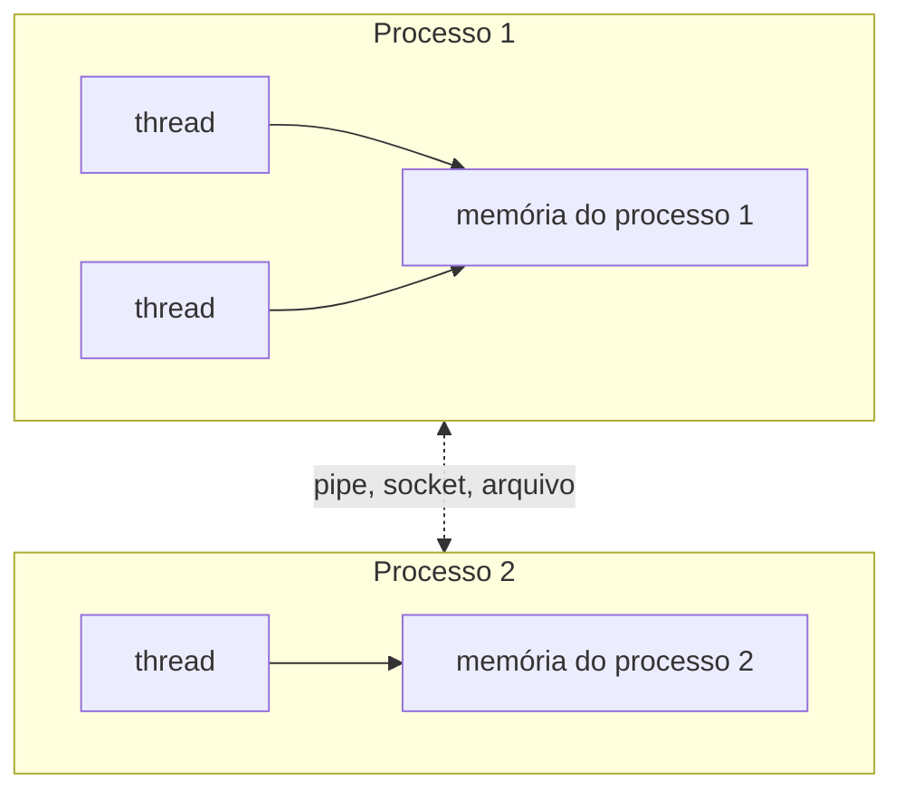

# Paradigmas de Programação — Aula 08: Concorrência, gorrotinas e canais — Processos, threads e condição de corrida

## Introdução

O modelo de concorrência mais difundido nas linguagens de uso corrente é o de
**threads com memória compartilhada**: várias linhas de execução dentro de um
mesmo programa, todas lendo e escrevendo as mesmas variáveis. É o modelo de
Java, C, C++, C# e Python. Esta nota o apresenta em Java, a partir da
distinção entre processo e thread, e mostra o defeito característico dele: a
**condição de corrida**.

O defeito só existe porque o dado compartilhado é **mutável**. No paradigma
funcional da aula 07, em que nenhum valor é alterado depois de criado, duas
linhas de execução podem ler o mesmo dado sem interferência.

## Objetivos de aprendizagem

Ao final desta nota, espera-se que o aluno seja capaz de:

1. Distinguir processo de thread pelo que cada um compartilha.
2. Explicar por que a ordem de execução de threads não é determinística.
3. Explicar por que `contador++` executado por duas threads produz condição de
   corrida, decompondo a operação em leitura, soma e escrita.
4. Corrigir a condição de corrida com `synchronized`, e enunciar o custo da
   correção.

## Desenvolvimento teórico

### Processo

Um **processo** é um programa em execução, com **espaço de endereçamento
próprio**: a memória de um processo não é visível para outro. Dois processos
que precisam trocar dados o fazem por um meio externo à memória — arquivo,
*pipe*, *socket*, saída padrão — mediado pelo sistema operacional.

O isolamento é a garantia do modelo: um processo não corrompe a memória de
outro. O custo é a comunicação, que exige cópia de dados entre espaços de
endereçamento e chamadas ao sistema operacional.

### Thread

Uma **thread** é uma linha de execução **dentro** de um processo. Um processo
começa com uma thread e pode criar outras. Cada thread tem a própria pilha e o
próprio contador de programa, mas todas compartilham o espaço de endereçamento
do processo: as mesmas variáveis globais, os mesmos objetos no *heap*.



O compartilhamento torna a comunicação entre threads barata — basta escrever
numa variável que a outra lê — e é a origem do problema tratado adiante.

### A ordem de execução não é determinística

Quando duas threads estão prontas para executar, quem decide qual executa, por
quanto tempo e em que núcleo é o **escalonador** do sistema operacional. O
programa não controla essa decisão, e ela varia de uma execução para outra,
conforme a carga da máquina.

A consequência é que a ordem em que as instruções de threads diferentes são
intercaladas **não é determinística**: o mesmo programa, com a mesma entrada,
pode produzir saídas diferentes em execuções sucessivas.

### Condição de corrida

Uma **condição de corrida** (*race condition*) ocorre quando o resultado de um
programa depende da ordem em que operações concorrentes sobre um dado
compartilhado são intercaladas (GOETZ et al., 2006). Como essa ordem não é
determinística, o resultado também não é.

O exemplo canônico é o incremento. A instrução `contador++` parece uma operação
única, mas é uma sequência de **leitura-modificação-escrita** de três passos:

1. ler o valor de `contador` para um registrador;
2. somar 1 ao registrador;
3. escrever o registrador em `contador`.

Duas threads, `A` e `B`, incrementando o mesmo contador, que vale 5, podem ser
intercaladas assim:

| Passo | Thread A | Thread B | `contador` |
|---|---|---|---|
| 1 | lê 5 | | 5 |
| 2 | | lê 5 | 5 |
| 3 | soma: 6 | | 5 |
| 4 | | soma: 6 | 5 |
| 5 | escreve 6 | | 6 |
| 6 | | escreve 6 | **6** |

Houve dois incrementos e o contador avançou um. As duas threads leram o mesmo
valor antes de qualquer uma escrever, calcularam o mesmo resultado e o
escreveram duas vezes: um incremento se perdeu. Se a thread B só lesse depois
do passo 5, o resultado seria 7. O valor final depende da intercalação.

Repetida 100 000 vezes por thread, a perda deixa de ser rara. No arquivo
`03-condicao-de-corrida.java`, o total esperado é 200 000; três execuções
consecutivas, em um contêiner com 14 núcleos, deram 124 129, 122 551 e 117 646.

### Seção crítica e exclusão mútua

A **seção crítica** é o trecho de código que acessa o dado compartilhado — no
exemplo, o `contador++`. **Exclusão mútua** é a garantia de que, em cada
instante, no máximo uma thread executa a seção crítica.

Em Java, a palavra-chave `synchronized` provê exclusão mútua: um método
`synchronized` só é executado por uma thread por vez; as demais que o chamarem
esperam a vez. Com o incremento dentro de um método `synchronized`, os três
passos de uma thread não podem mais ser intercalados com os da outra, e o
resultado passa a ser sempre 200 000.

### O custo da trava

A exclusão mútua corrige o resultado ao preço de **serializar** a seção
crítica: enquanto uma thread a executa, as outras ficam paradas. Quanto maior a
seção crítica, menos concorrência resta.

O segundo custo é de engenharia. A trava é responsabilidade do programador: o
compilador não aponta um acesso compartilhado sem trava, e o programa com
condição de corrida compila e executa normalmente — produzindo resultado errado
apenas em algumas execuções. É a classe de defeito mais difícil de reproduzir e
de depurar em programas concorrentes.

## Exemplos

Os quatro arquivos em Java da aula, em `codigo/`, executados com
`java <arquivo>.java` em contêiner `eclipse-temurin:21`:

| Arquivo | O que demonstra |
|---|---|
| `01-processo.java` | o pai e o filho têm cópias separadas de `contador`: o filho imprime 11, o pai continua com 10 |
| `02-threads.java` | duas threads imprimindo; a ordem das linhas muda entre execuções |
| `03-condicao-de-corrida.java` | `contador++` em duas threads; o total fica abaixo de 200 000 |
| `04-com-trava.java` | o mesmo contador com `synchronized`; o total é sempre 200 000 |

O trecho central da correção:

```java
static int contador = 0;

// Seção crítica: só uma thread por vez executa este método.
static synchronized void incrementar() {
    contador++;
}
```

## Fontes e leituras

- GOETZ, Brian et al. **Java Concurrency in Practice.** Boston:
  Addison-Wesley, 2006. Capítulo 2 (*Thread Safety*).
- DONOVAN, Alan A. A.; KERNIGHAN, Brian W. **The Go Programming Language.**
  Boston: Addison-Wesley, 2015. Capítulo 9 (*Concurrency with Shared
  Variables*).
